# June-LeetCoding-Challenge
Python Solutions to June LeetCoding Challenge

<ul>
    <li>
		
Day 1: Invert Binary Tree

		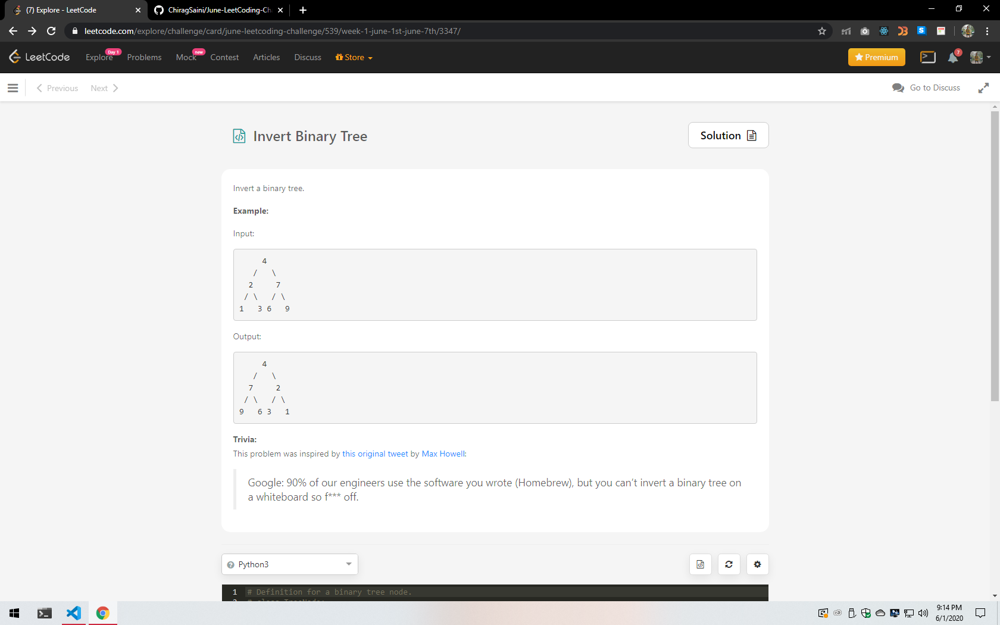
    </li>
    <li>
		
Day 2: Delete a Node in a Linked List

		
    </li>
    <li>
		
Day 3: Two City Scheduling

		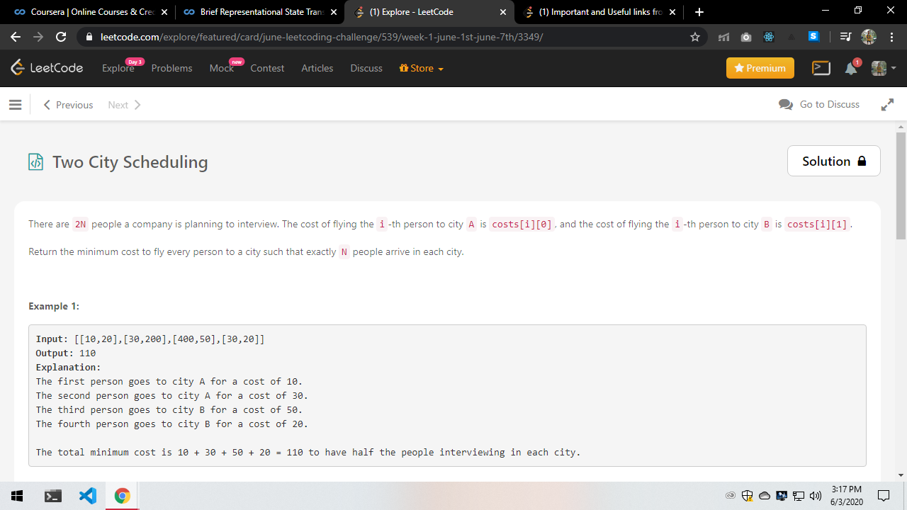
    </li>
    <li>
		
Day 4: Reverse String

		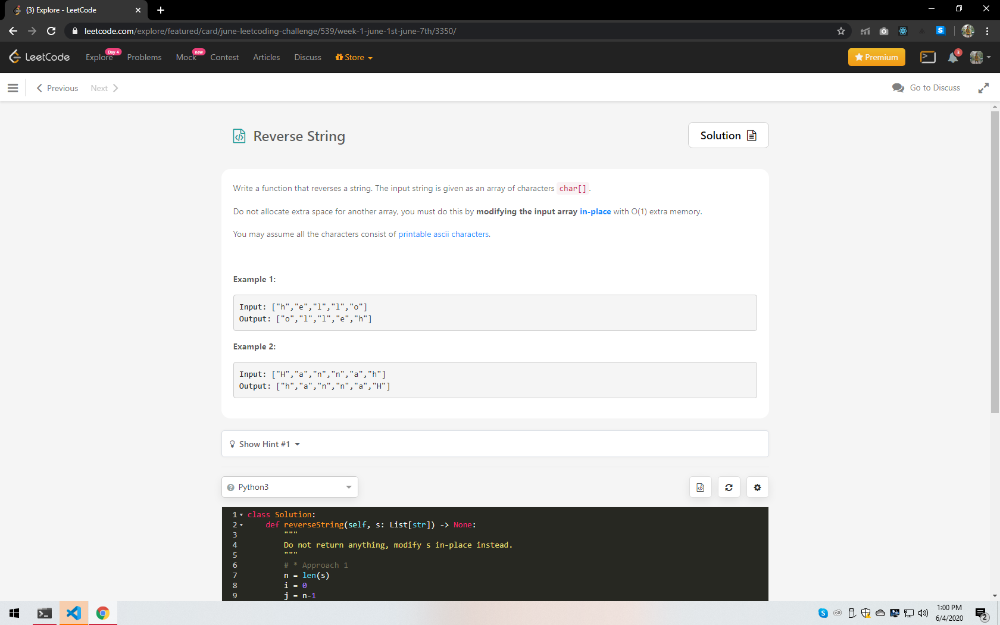
    </li>
    <li>
		
Day 5: Random Pick with Weight

		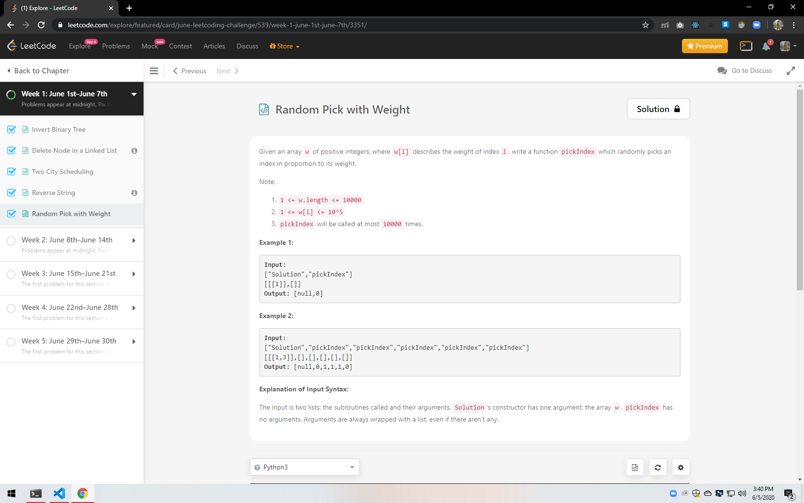
    </li>
    <li>
		
Day 6: Queue Reconstruction by Height

		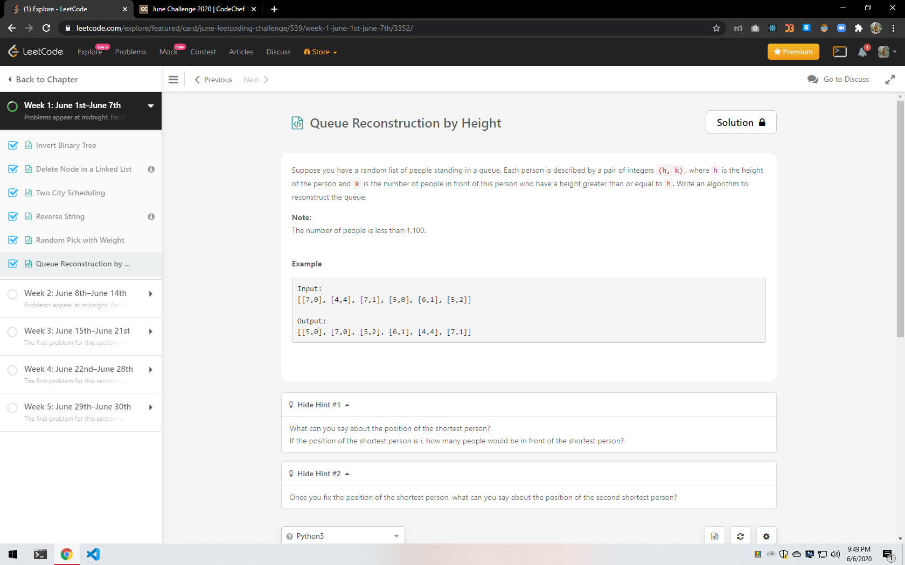
    </li>
    <li>
		
Day 7: Coin Change 2

		
A Classic DP pronlem

		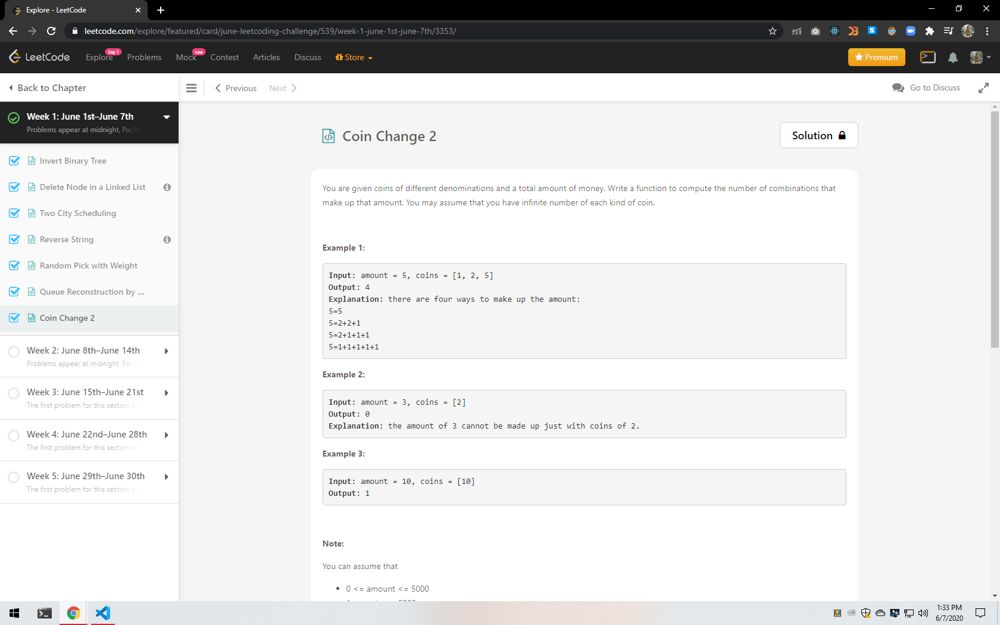
    </li>
	<li>
		
Day 8: Power of 2

		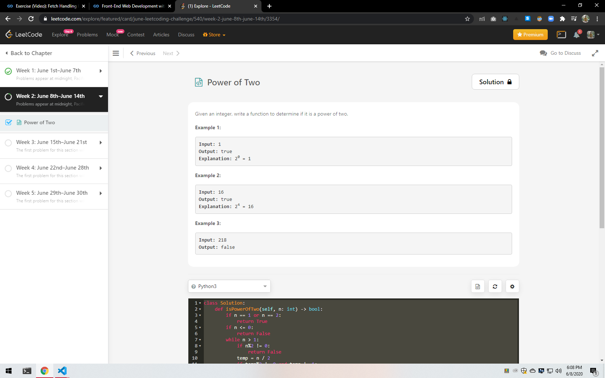
    </li>
	<li>
		
Day 9: Is Subsequence

		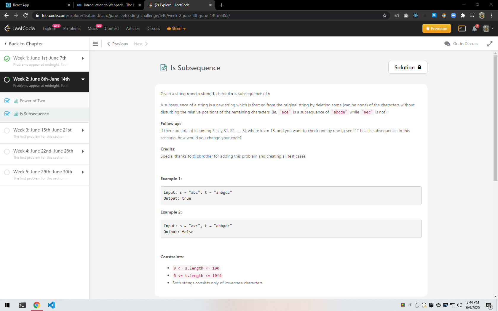
    </li>
	<li>
		
Day 10: Search Insert Position

		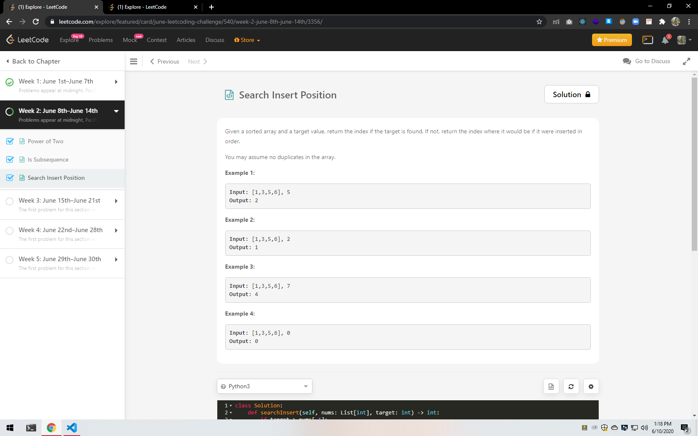
	</li>
	<li>
		
Day 11: Sort Colors

		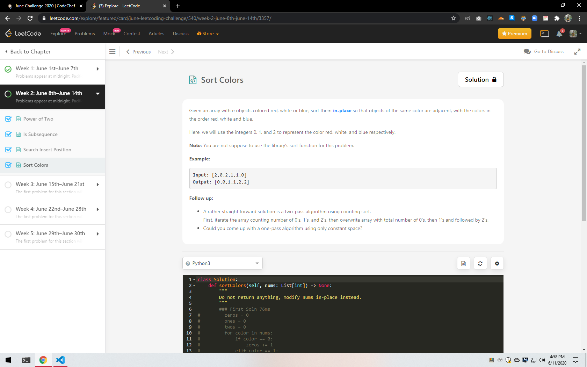
	</li>
	<li>
		
Day 12: Insert Delete getRandom O(1)

		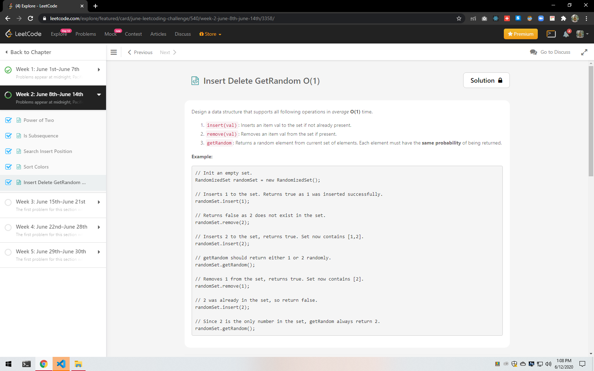
	</li>
</ul>