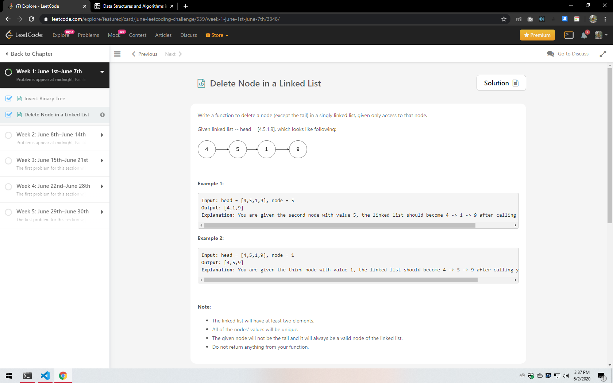
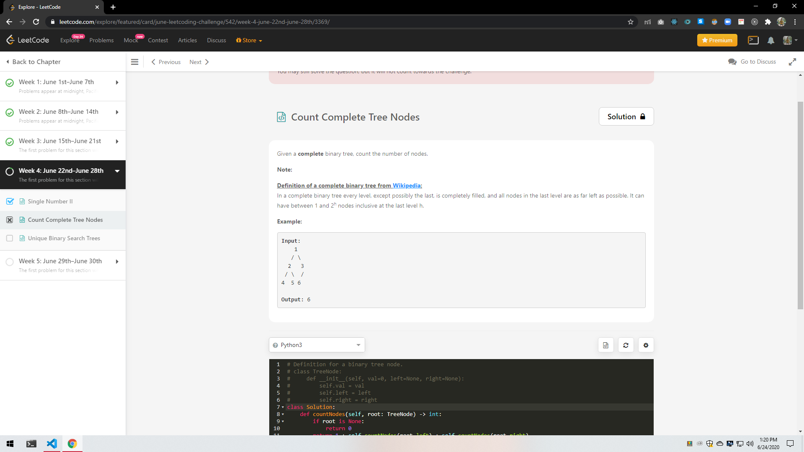

# June-LeetCoding-Challenge
Python Solutions to June LeetCoding Challenge

<ul>
    <li>
		
Day 1: Invert Binary Tree

		
    </li>
    <li>
		
Day 2: Delete a Node in a Linked List

		
    </li>
    <li>
		
Day 3: Two City Scheduling

		
    </li>
    <li>
		
Day 4: Reverse String

		
    </li>
    <li>
		
Day 5: Random Pick with Weight

		
    </li>
    <li>
		
Day 6: Queue Reconstruction by Height

		
    </li>
    <li>
		
Day 7: Coin Change 2

		
A Classic DP pronlem

		
    </li>
	<li>
		
Day 8: Power of 2

		
    </li>
	<li>
		
Day 9: Is Subsequence

		
    </li>
	<li>
		
Day 10: Search Insert Position

		
	</li>
	<li>
		
Day 11: Sort Colors

		
	</li>
	<li>
		
Day 12: Insert Delete getRandom O(1)

		
	</li>
	<li>
		
Day 13: Largest Divisible Subset

		
	</li>
	<li>
		
Day 14: Cheapest Flight within K Stops

		
	</li>
	<li>
		
Day 15: Search in a Binary Search Tree

		
	</li>
	<li>
		
Day 16: Validate IP Address

		
	</li>
	<li>
		
Day 17: Surrounded regions

		
	</li>
	<li>
		
Day 18: H-Index 2

		
	</li>
	<li>
		
Day 19: Longest Duplicate Substring(Really Hard)

		
Unable to Solve it

		
	</li>
	<li>
		
Day 20: Permutation Sequence

		
	</li>
	<li>
		
Day 21: Dungeon Game

		
	</li>
	<li>
		
Day 22: Single Number 2

		
	</li>
	<li>
		
Day 23: Count Complete Tree Nodes

		
	</li>
	<li>
		
Day 24: Unique Binary Search Trees

		
	</li>
</ul>